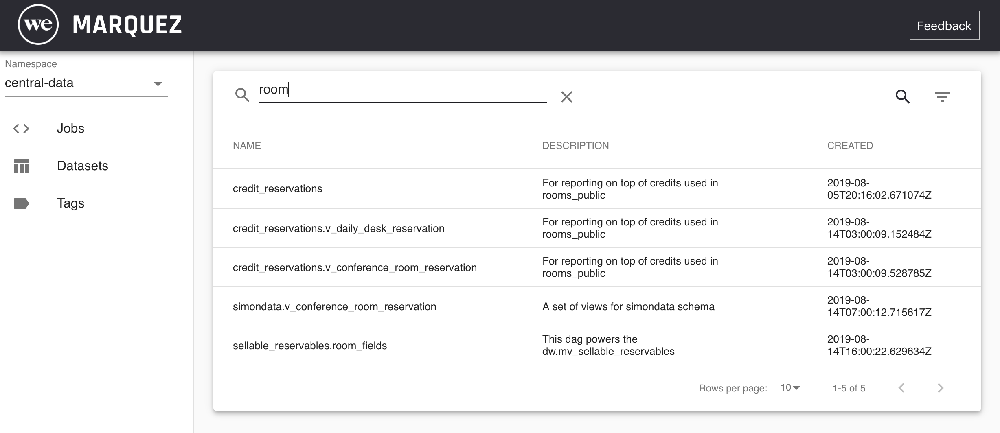

# Marquez Web UI

[](#status)

Marquez is an open source **metadata service** for the **collection**, **aggregation**, and **visualization** of a data ecosystem's metadata.

This web UI is used to view metadata collected and cataloged by [Marquez](https://github.com/MarquezProject/marquez).

<figure align="center">
  
</figure>

## Status

This project is under active development at [The We Company](https://www.we.co) (in collaboration with many others organizations).

## Running [App.js](https://github.com/WeConnect/marquez-web/blob/master/src/App.js) 

1. Install dependencies:

   ```
   $ npm install
   ```
   
2. Run server:
   
   ```
   $ npm start
   ```

## Running with [Docker](./Dockerfile) 

1. Build image:

   ```
   $ docker build -t marquez-web .
   ```
   
2. Run image:
   
   ```
   $ docker run -p 3000:3000 -d marquez-web
   ```
   
You can open http://localhost:3000 to begin exploring the web UI. 
